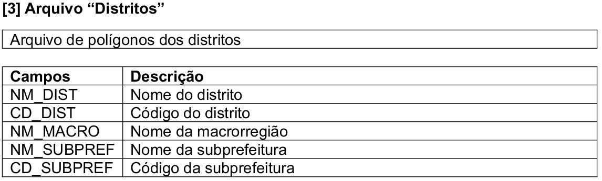
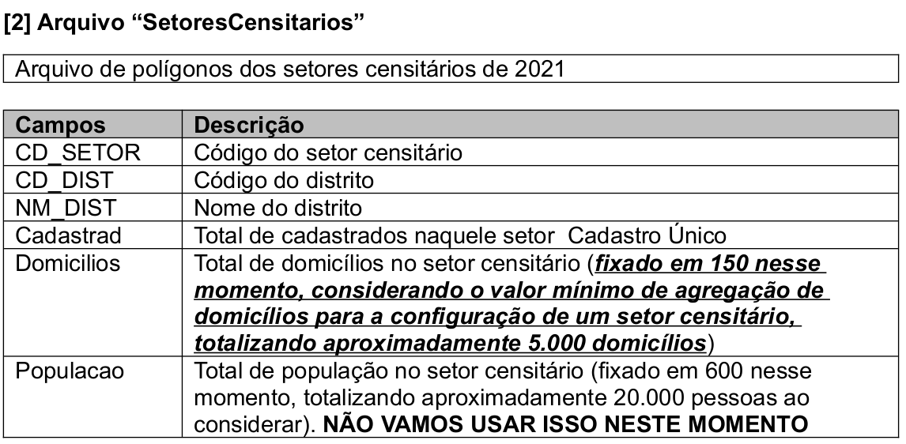
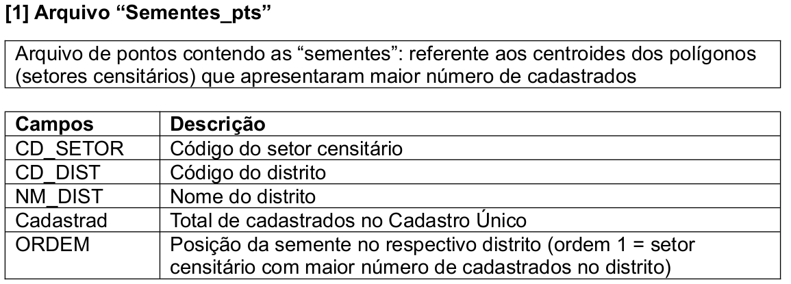

# SPCAD Project

This code repository is part of the SPCAD Project and contains the Proof of Concept algorithm.

## Description

As context we have the three Geographic data that represent Districts, Sectors and Seeds. District and Sector are part of the IBGE census data and Seed is a point within a Sector, defined in the SPCAD Project, which represents one of the centers of greatest social attention needed for a District.

The algorithm is used to discover the best buffer for each seed, obtain sectors by intersecting the buffer, and join these sectors into an ACDPS, "Áreas de Concentração de Demanda para Proteção Social", unit based on some rules as described below.

 > Rules

 - The reference value to limit the number of Sectors used to form each ACDPS is 5000* and the **upper limit** accepts 10% variation;
 - The reference value used to join an ACDPS area into another is 1000* as **lower threshold**;
 - The increase in the buffer in each seed is limited to the sum of the number of families in each sector fetched by the intersection between the buffer and the sectors, respecting the **upper limit**; 
 - The sectors fetched by the intersection need is contiguous to form an ACDPS area;
 - When an ACDPS area that has one or more holes needs to make the sectors that are below those holes join the ACDPS area to fill the respective holes;
 - When an ACDPS area is smaller than a **lower threshold**, this ACDPS needs to be aggregated with the nearest neighboring ACDPS. The proximity measure is based on the Seeds used to form the related ACDPS within the District.

*The unit of values is the number of families in each Sector given by one of the Sector attributes.

## Build the environment to run

### Into Google Colab

You can test the code in the Google Colab environment as an option, instead of creating and configuring your own environment.

Use my "docs/spcad.ipynb" file to create your own Colab using the "Upload notebook file" option.

https://colab.research.google.com/


### Into localhost

Here is described how to build the environment to run this algorithm.

Prerequisites:
   - A local directory where Python scripts and input/output data are placed. See details in the **"Data Location"** section;
   - The input data in shapefile format with the columns defined in the **"Input data metadata"** section;
   - Python 3.10.x and dependencies as described in the **"Python Environment"** section;
   - Make the configuration by reviewing the config.py file, ensuring that the necessary parameters have the correct values as described in the **"Configuration"** section;

After all prerequisites is read, you can run the script using the command below:
```sh
python start.py
```

#### Data Location

To work, the algorithm expects the following directory organization.

Somewhere on your machine, paste the files from this repository. An alternative is to download the zip package [of a Release](https://github.com/andre-carvalho/spcad/releases) and unzip it into the desired directory. Other way is clone this GIT repository into the desired directory.

After that, make the new directory called **data** and inside it, make two more directories called **input** and **output**, so we have this structure:

```
~/spcad/
   |
   seed_process.py
   config.py
   requirements.txt
   README.md
   |
   docs/<some files used in this documentation>
   |
   data/
      |
      input/<where the input shapefiles are placed before running the script>
      |
      output/<where the output shapefiles will be written after running the script>
```

#### Python Environment

How to install Python and dependencies on local machine.

 1. Install the Python 3.10.x language interpreter.

You can following instructions by https://realpython.com/installing-python/ 
or https://docs.python.org/3/using/index.html to install the Python language interpreter on your system platform.

 2. Install dependencies from requiremets.

With Python installed, use the Package Installer for Python (pip) to install the required dependencies listed in the requirements.txt file.

```sh
pip install -r requirements.txt
```

#### Input data metadata

In this version of the algorithm, the column names must be the same as described here.

<p>
The District column description<br/>

</p>

<p>
The Sector column description<br/>

</p>

<p>
The Seed column description<br/>

</p>


#### Output data

The main output data is an ACDPS file with geometry and attributes. The name of this file and the other outputs are defined and can be changed in config.py as follows:

```python
    # used as name of output shapefiles when writing processed data.
    output_file_acdps="acdps"
    output_file_sectors="sectors_by_seed"
    output_file_seeds="buffer_around_seeds"
    output_file_orphans="orphan_sectors"
```

 - "output_file_acdps", contain the polygons of the area of each ACDPS found by the algorithm after the buffer search in the seeds and aggregation. Use sector dissolves.

   * acdp_id: numerical sequence to identify each unit;
   * seed_id: identifier of the seed used in the search;
   * n_sectors: number of sectors found and used in acdps aggregation;
   * cd_sectors: list of sector codes used in acdps aggregation;
   * cd_dist: original district code;
   * area_m2: area in square meters of the acdps;
   * num_dom: total sum of households from the aggregated sectors;

 - "output_file_sectors", contain the sectors selected by each buffer in the acdps search process.

   * sec_id: sector identifier of the loaded input data in memory;
   * cd_dist: original district code;
   * cd_setor: original sector code;
   * num_cad: original number of registered people in the sector;
   * num_dom: original number of households in the sector;
   * seed_id: seed identifier of the loaded input data in memory;
   * acdp_id: numeric sequence to identify each acdps. It is associated with "output_file_acdps";

 - "output_file_seeds", contain the circles that correspond to the final buffer applied to the seeds in the acdps search process.

   * seed_id: identifier of the seed used to form the circle;
   * buffer_val: final value of the buffer applied to the seed;
   * num_dom: total sum of households from the sectors selected by the buffer;

 - "output_file_orphans", contain the sectors that were orphaned after the acdps search process.

   * sec_id: sector identifier of the loaded input data in memory;
   * cd_dist: original district code;
   * cd_setor: original sector code;
   * num_cad: original number of registered people in the sector;
   * num_dom: original number of households in the sector;

#### Configuration

The configuration must be reviewed before run the script and is performed by editing the config.py file.

So, open the config.py file using any text editor and adjust the parameter values as needed.
To help, each parameter has a description on the line above.


The config.py content:
```python
class Config:

    # used as name of input shapefiles when loading data into memory.
    input_file_seeds="Sementes_pts.shp"
    input_file_sectors="SetoresCensitarios.shp"
    input_file_districts="Distritos.shp"
    
    # the default limit used to join minor ACDPs to nearest neighbor.
    lower_limit=1000
    # the number of units used to increase the buffer around the seeds to make an ACDP. Based on input data projection.
    buffer_step=5
    # the value to apply over the limit_to_stop to accept agregation of sectors.
    percent_range=10
    # the reference value to finalize the sectoral aggregation of a seed influence area
    limit_to_stop=5000
    # the type of output file used to store the results. Only supports OGR types for the version used in the environment.
    # See the README instructions to choose a valid value.
    output_type="gpkg"

    # used as name of output shapefiles when writing processed data.
    output_file_acdps="acdps"
    output_file_sectors="sectors_by_seed"
    output_file_seeds="buffer_around_seeds"
    output_file_orphans="orphan_sectors"
```


**Type of Output file**

To change the type of output file you can choose one of the drivers supported by the used libraries installed in your environment. To obtain the list of supported drivers, use the commands below, and choose an option that is reported as 'rw' or 'raw'.

```sh
(venv) user@hostname:~/Projects/spcad$ python
Python 3.10.12 (main, Nov 20 2023, 15:14:05) [GCC 11.4.0] on linux
Type "help", "copyright", "credits" or "license" for more information.
>>> import fiona
>>> fiona.supported_drivers
{'DXF': 'rw', 'CSV': 'raw', 'OpenFileGDB': 'raw', 'ESRIJSON': 'r', 'ESRI Shapefile': 'raw', 'FlatGeobuf': 'raw', 'GeoJSON': 'raw', 'GeoJSONSeq': 'raw', 'GPKG': 'raw', 'GML': 'rw', 'OGR_GMT': 'rw', 'GPX': 'rw', 'MapInfo File': 'raw', 'DGN': 'raw', 'S57': 'r', 'SQLite': 'raw', 'TopoJSON': 'r'}
```

In this version of the algorithm, the tested options are: 'ESRI Shapefile' and 'GPKG'

Since shapefile is more limited than GeoPackage, the default for writing output data is GeoPackage.
*For the column with a list of sector codes in the ACDPS output, the maximum length is 255 and the data is truncated.

You can change to shapefile on config.py before run.

## Developer

My choice of IDE is [VSCode](https://code.visualstudio.com/).

This repository is developed on [Linux Ubuntu](https://ubuntu.com/) 22.04 LTS and Python 3.10.x. It is recommended that you use a virtual environment to prepare your development environment.

Step by step:

- First all you should clone repository
- Them enter into the created directory
- Create the virtual environment for Python

```sh
sudo apt-get install python3-venv
python3 -m venv env
```

- Active the virtual environment

```sh
source env/bin/activate
```

- Install the packages using pip and the requirements.txt for modules that you need for your service.

```sh
pip install -r requirements.txt
```

## Useful links

https://python.org/ and https://realpython.com/installing-python/

https://pip.pypa.io/

https://geopandas.org/

https://code.visualstudio.com/

https://ubuntu.com/

## Feedback to author

If you have any feedback or questions, please reach me at: afacarvalho@yahoo.com.br